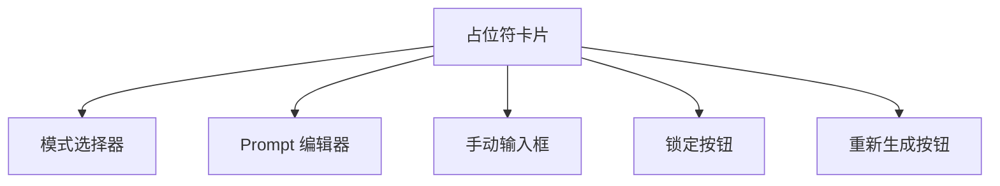

# Design: 增强占位符管理

## 技术方案

### 1. DOCX 原生预览 (docx-preview.js)

使用纯前端库渲染 DOCX，无需服务端转换：

```html
<script src="https://unpkg.com/docx-preview/dist/docx-preview.min.js"></script>

<script>
docx.renderAsync(file, container, null, {
    inWrapper: true,
    ignoreWidth: false,
    ignoreHeight: false
});
</script>
```

### 2. 占位符配置数据结构

```typescript
interface PlaceholderConfig {
    name: string;
    mode: 'auto' | 'select' | 'manual';
    prompt?: string;           // LLM prompt
    manualValue?: string;      // 手动输入值
    optionsCount?: number;     // select 模式选项数
    locked?: boolean;          // 锁定（不重新生成）
}
```

### 3. API 扩展

| 端点 | 功能 |
|------|------|
| `POST /api/regenerate/{session}/{placeholder}` | 单独重新生成 |
| `POST /api/configs` | 保存配置 |
| `GET /api/configs` | 列出配置 |
| `GET /api/configs/{id}` | 加载配置 |
| `DELETE /api/configs/{id}` | 删除配置 |

### 4. 配置存储

```json
{
    "configs": {
        "project_report": {
            "name": "项目报告模板",
            "template_hash": "abc123",
            "placeholders": {
                "TITLE": { "mode": "select", "prompt": "..." },
                "DATE": { "mode": "manual", "manualValue": "2024年1月" }
            }
        }
    }
}
```

## UI 组件


