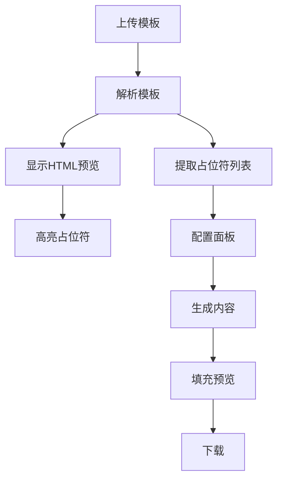

# Design: Enhanced Template Viewer Architecture

## Overview

增强模板预览界面，提供模板可视化、占位符高亮和填充预览功能。

## 技术方案

### DOCX 转 HTML

使用 `mammoth` 库将 DOCX 转换为 HTML：

```python
import mammoth

with open("template.docx", "rb") as f:
    result = mammoth.convert_to_html(f)
    html = result.value
```

### 占位符高亮

```javascript
// 前端高亮逻辑
html = html.replace(
    /\{\{(\w+)\}\}/g, 
    '<span class="placeholder" data-name="$1">{{$1}}</span>'
);
```

## 界面组件



## 新增 API

| 端点 | 方法 | 功能 |
|------|------|------|
| `/api/parse-template` | POST | 解析模板返回 HTML + 占位符 |
| `/api/preview-filled/{id}` | POST | 返回填充后的 HTML |

## 依赖

- `mammoth` - DOCX 转 HTML
