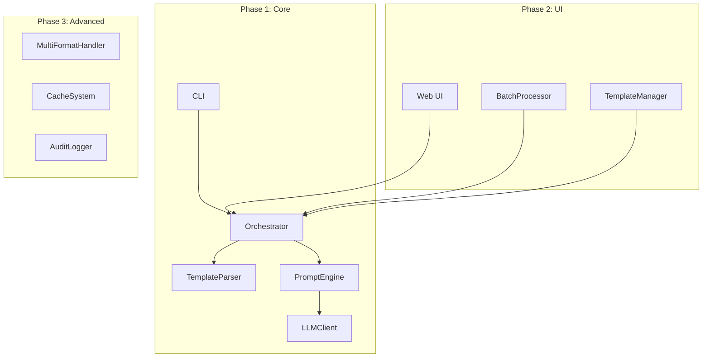
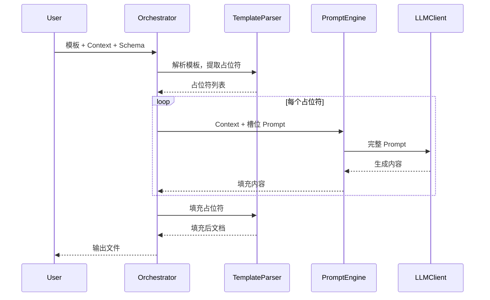

# Design: Template Filler Architecture

## Overview

系统输入：`模板文件` + `原始材料 (Context)` + `Schema`  
系统输出：`填充后的文档`

## 系统架构



## Phase 1: 核心组件

### 1. TemplateParser
- **库**：`python-docx`
- **占位符格式**：`{{KEYWORD}}`
- **格式保留**：在 `run` 级别替换文本，保留原有样式

### 2. PromptEngine
- **输入**：
    - `Context`：原始材料
    - `Schema`：占位符 → Prompt 映射
- **输出**：构造完整 Prompt 发送给 LLM

### 3. LLMClient
- 抽象客户端，支持切换提供商（OpenAI、Gemini、本地等）
- 重试机制和错误处理

### 4. Orchestrator
1. 加载模板和 Schema
2. 提取占位符列表
3. 并发生成各占位符内容
4. 填充模板
5. 保存文件

## Phase 2: 易用性组件

### 1. Web UI
- 前端：HTML + CSS + JavaScript
- 功能：上传/粘贴内容、选择模板、预览结果、下载

### 2. BatchProcessor
- 支持批量输入（多份 Context）
- 并行处理多个模板

### 3. TemplateManager
- 模板库管理
- Schema 配置界面

## Phase 3: 高级组件

### 1. MultiFormatHandler
- 支持 XLSX（`openpyxl`）
- 支持 PDF（`reportlab` 或模板引擎）

### 2. CacheSystem
- 缓存 LLM 响应
- 相同 Context 复用

### 3. AuditLogger
- 记录生成日志
- 输入/输出追溯

## 数据流



## 并发策略

- 多个占位符的 LLM 调用可并发执行
- 使用 `asyncio` 或 `concurrent.futures`

## 配置文件格式

### Schema (YAML)
```yaml
template: "report_template.docx"
placeholders:
  TITLE:
    prompt: "根据以下内容，生成一个简洁的标题（10字以内）"
    mode: "select"       # select: 生成多个选项供用户选择
    options_count: 3     # 生成 3 个候选
  SUMMARY:
    prompt: "根据以下内容，生成一段100字左右的摘要"
    mode: "auto"         # auto: 自动填充（默认）
  SIGNIFICANCE:
    prompt: "根据以下内容，总结其意义和价值"
    # mode 默认为 auto
```

### Context
```
[用户粘贴的原始材料...]
```
