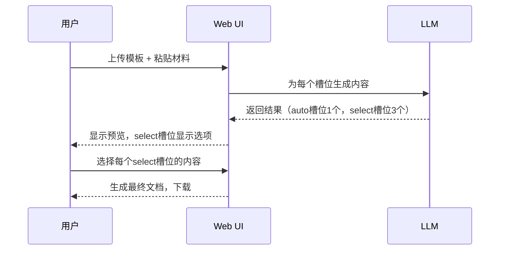

# Proposal: Template Filler Tool

## Background

用户需要一个工具来自动化填写文档模板（主要是 Word 文档）。这些模板结构固定，但包含需要根据提供的上下文动态填充的"槽位"。每个槽位的内容由大语言模型（LLM）根据特定的 Prompt 生成。

## Problem

- 手工填写重复性文档耗时。
- Word 文档的格式必须严格保留。
- 内容生成需要智能处理（LLM）。
- **部分内容需要用户选择/确认**，而非完全自动填充。

## Goals

1. **自动化填充**：输入模板 + 原始材料 + Schema，输出填充后的文档。
2. **格式保留**：输出文档必须与模板的样式和布局完全一致。
3. **LLM 集成**：通过 Prompt 动态生成各槽位内容。
4. **多选项支持**：部分槽位可生成多个候选内容，供用户选择。
5. **批量处理**：支持一次处理多个模板或多份内容。
6. **用户友好**：提供直观的交互界面。

---

## 交互方式对比

| 方式 | 优点 | 缺点 | 适用场景 |
|------|------|------|----------|
| **CLI** | 简单、可脚本化 | 无法预览、无法交互选择 | 自动化批量处理 |
| **Web UI** | 可视化、支持预览和选择 | 需要部署 | 日常使用、需要用户参与 |
| **VS Code 插件** | 集成开发环境、无需切换窗口 | 需要用户安装 VS Code | 开发者用户 |
| **桌面应用 (Electron)** | 独立运行、跨平台 | 开发成本高 | 非技术用户 |
| **Word 插件 (VSTO/Add-in)** | 直接在 Word 中操作 | 开发复杂、仅限 Word | 重度 Word 用户 |

### 推荐方案

**主要方式：Web UI（本地部署）**
- 无需安装复杂软件
- 支持预览和多选项选择
- 可在浏览器中直接操作

**辅助方式：CLI**
- 用于批量自动化处理
- 可集成到脚本/工作流中

---

## 新增功能：多选项生成

### 场景
某些槽位（如"标题"、"摘要"）可能有多种表达方式，用户希望从多个 LLM 生成的候选中选择最合适的。

### 实现方式

```yaml
# Schema 配置
placeholders:
  TITLE:
    prompt: "生成一个简洁的标题"
    mode: "select"      # 新增：select 模式，生成多个选项
    options_count: 3    # 生成 3 个候选
  SUMMARY:
    prompt: "生成摘要"
    mode: "auto"        # auto 模式：自动填充（默认）
```

### 交互流程



---

## Proposed Solution

开发一个 Python 工具 `template-filler`，分阶段实现：

### Phase 1: MVP (核心功能)
- CLI 工具
- DOCX 模板解析与填充
- LLM 内容生成（auto 模式）
- 格式保留

### Phase 2: 交互增强
- Web UI（本地部署）
    - 模板上传
    - 材料粘贴
    - 预览结果
    - **多选项选择 (select 模式)**
    - 下载文档
- 批量处理

### Phase 3: 高级功能
- 模板管理系统
- 多格式支持（XLSX、PDF）
- 占位符自动检测
- 缓存/复用
- 日志/审计

---

## Scope

- **Phase 1**：核心 CLI 工具，支持 DOCX，auto 模式
- **Phase 2**：Web UI + select 模式 + 批量处理
- **Phase 3**：多格式 + 高级功能
